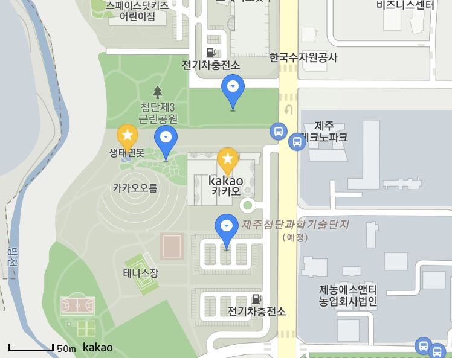

# kakao api  
- 하루 300,000 건 무료   
- 참고: https://apis.map.kakao.com/  

# API KEY 발급  
- https://developers.kakao.com/ 에서 개발자 등록, 앱 등록 - 플랫폼 웹으로 선택, 도메인 등록 (ex. http://127.0.0.1:8000)  
- JavaScript 키를 api 키로 사용한다  

# 지도 생성하기  
```
<body>
    <!--지도를 담을 영역-->
    <div id = "map" style = "width:500px; height: 400px;"></div>
    <!--지도 api 불러오기-->
    <script type="text/javascript" src="//dapi.kakao.com/v2/maps/sdk.js?appkey=키 입력"></script>
    
    <!--지도를 생성해 영역에 담기-->
    <script>
        var container = document.getElementById('map'); //지도를 담을 영역의 DOM 레퍼런스
        var options = { //지도를 생성할 때 필요한 기본 옵션
	    center: new kakao.maps.LatLng(33.450701, 126.570667), //지도의 중심좌표-위도, 경도
	    level: 3 //지도의 레벨(확대, 축소 정도)
        };

        var map = new kakao.maps.Map(container, options); //지도 생성 및 객체 리턴
    </script>
</body>
```  
- `new kakao.maps.Map(container, options)`로 지도 생성  
    - `container`: 지도를 담을 영역(html element)  
    - `options`  (dict 형태)
        - `center`: 반드시 필요. LatLng의 객체로 위도와 경도 값을 순서대로 주어야 한다  
            `center: new kakao.maps.LatLng(위도, 경도)` 
        - `draggable: false` 지도 이동, 확대 축소 불가  

- 스크롤바로 지도 확대 및 축소 가능  
- 마우스로 지도 위치 이동 가능  

# 관련 라이브러리  
- `clusterer`: 지도 마킹  
- `services`: 장소 검색, 주소-좌표 변환  
- `drawing`: 지도 위에 마커와 그래픽스 객체를 쉽게 그릴 수 있음  

```
<!-- services와 clusterer, drawing 라이브러리 불러오기 -->
<script type="text/javascript" src="//dapi.kakao.com/v2/maps/sdk.js?appkey=APIKEY&libraries=services,clusterer,drawing"></script>
```  

# 마커 생성  
```
// 마커 위치 지정
var markerPosition  = new kakao.maps.LatLng(33.450701, 126.570667); 
    
// 마커를 생성
var marker = new kakao.maps.Marker({
    position: markerPosition
});

// 마커가 지도 위에 표시되도록 설정
marker.setMap(map);

// 지도 위의 마커를 제거
marker.setMap(null);      
```

## 마커 여러개 생성  
```
// 마커를 표시할 위치와 title 객체 배열 
var positions = [
    {
        title: '장소1', 
        latlng: new kakao.maps.LatLng(33.450705, 126.570677)
    },
    {
        title: '장소2', 
        latlng: new kakao.maps.LatLng(33.450936, 126.569477)
    },
];

// 마커 이미지의 이미지 주소
var imageSrc = "https://t1.daumcdn.net/localimg/localimages/07/mapapidoc/markerStar.png"; // 즐겨찾기 마커
    
for (var i = 0; i < positions.length; i ++) {
    
    // 마커 이미지의 이미지 크기
    var imageSize = new kakao.maps.Size(24, 35); 
    
    // 마커 이미지 생성    
    var markerImage = new kakao.maps.MarkerImage(imageSrc, imageSize); 
    
    // 마커 생성
    var marker = new kakao.maps.Marker({
        map: map, // 마커를 표시할 지도
        position: positions[i].latlng, // 마커를 표시할 위치
        title : positions[i].title, // 마커의 타이틀, 마커에 마우스를 올리면 타이틀이 표시
        image : markerImage // 마커 이미지 
    });
}
```
## 마커 카테고리 나누기 
카테고리에 따라 다른 마커로 표시하기: 다른 배열에 positions를 저장하여 for문을 쓴다  
```
// 기본 마커 이미지로 표시할 때 
var normal_positions = [
    {
        title: '일반 공연1',  // title은 공연 이름으로 
        latlng: new kakao.maps.LatLng(33.450879, 126.569940)
    },
    {
        title: '일반 공연2', 
        latlng: new kakao.maps.LatLng(33.451393, 126.570738)
    },
];

for (var i = 0; i < normal_positions.length; i ++) {
    // 마커를 생성
    var marker = new kakao.maps.Marker({
        map: map, // 마커를 표시할 지도
        position: normal_positions[i].latlng, // 마커를 표시할 위치
        title : normal_positions[i].title, // 마커의 타이틀, 마커에 마우스를 올리면 타이틀이 표시
    });
}
```


## Geocoding, Reverse Geocoding 
- `services` 라이브러리 불러오기  
`<script type="text/javascript" src="//dapi.kakao.com/v2/maps/sdk.js?appkey=APIKEY&libraries=services"></script>` 
### 좌표 -> 주소 
- 주소-좌표 변환 객체를 생성 `var geocoder = new kakao.maps.services.Geocoder();`  
- `Geocoder`객체의 `coord2detailaddr` 메소드를 이용해 위치 좌표에 대한 상세주소정보(도로명주소, 지번주소) 리턴 가능(건물이 없는 경우 지번주소만) 
- `coord2RegionCode(x, y, callback, options)`  
    - `x`: x 좌표, 경도
    - `y`: y 좌표, 위도  
    - `callback`: 검색 결과를 받을 콜백함수  
    - `options`: optional  

    - 결과: `result`라는 array  
        - `result[0].address_name`: 도로명 주소  
        - `result[1].address_name`: 지번 주소  

```
// 예시 코드  
var geocoder = new kakao.maps.services.Geocoder();

var callback = function(result, status) {
    if (status === kakao.maps.services.Status.OK) {

        console.log('지역 명칭 : ' + result[0].address_name);
        console.log('행정구역 코드 : ' + result[0].code);
    }
};

geocoder.coord2RegionCode(126.9786567, 37.566826, callback);
```
#### 위도 경도 구하기  
```
var latlng = new kakao.maps.LatLng(37, 127);
latlng.getLat(); // 37 위도
latlng.getLng(); // 127 경도 
```
#### 지도에서 찍은 좌표의 주소와 위도 경도 반환 
```
var mapContainer = document.getElementById('map'), // 지도를 표시할 div 
    mapOption = {
        center: new kakao.maps.LatLng(37.566826, 126.9786567), // 지도의 중심좌표
        level: 1 // 지도의 확대 레벨
    };  

// 지도를 생성합니다    
var map = new kakao.maps.Map(mapContainer, mapOption); 

// 주소-좌표 변환 객체를 생성합니다
var geocoder = new kakao.maps.services.Geocoder();

var marker = new kakao.maps.Marker(), // 클릭한 위치를 표시할 마커입니다
    infowindow = new kakao.maps.InfoWindow({zindex:1}); // 클릭한 위치에 대한 주소를 표시할 인포윈도우입니다


// 지도를 클릭했을 때 클릭 위치 좌표에 대한 주소정보를 표시하도록 이벤트를 등록합니다
kakao.maps.event.addListener(map, 'click', function(mouseEvent) {
    searchDetailAddrFromCoords(mouseEvent.latLng, function(result, status) {
        if (status === kakao.maps.services.Status.OK) {
            var detailAddr = !!result[0].road_address ? '<div>도로명주소 : ' + result[0].road_address.address_name + '</div>' : '';
            detailAddr += '<div>지번 주소 : ' + result[0].address.address_name + '</div>';
            
            var content = '<div class="bAddr">' +
                            '<span class="title">법정동 주소정보</span>' + 
                            detailAddr + 
                        '</div>';

            // 마커를 클릭한 위치에 표시합니다 
            marker.setPosition(mouseEvent.latLng);
            marker.setMap(map);

            // 인포윈도우에 클릭한 위치에 대한 법정동 상세 주소정보를 표시합니다
            infowindow.setContent(content);
            infowindow.open(map, marker);
        }   
    });
});

function searchAddrFromCoords(coords, callback) {
    // 좌표로 행정동 주소 정보를 요청합니다
    geocoder.coord2RegionCode(coords.getLng(), coords.getLat(), callback);         
}

function searchDetailAddrFromCoords(coords, callback) {
    // 좌표로 법정동 상세 주소 정보를 요청합니다
    geocoder.coord2Address(coords.getLng(), coords.getLat(), callback);
}
```


## 주소 -> 좌표
```
var mapContainer = document.getElementById('main_map'), // 지도를 표시할 div 
    mapOption = {
        center: new kakao.maps.LatLng(37.55534870467689, 126.93710965061135), // 지도의 중심좌표: 신촌역
        level: 4 // 지도의 확대 레벨
    };  

// 지도를 생성합니다    
var main_map = new kakao.maps.Map(mapContainer, mapOption); 

// 주소-좌표 변환 객체를 생성합니다
var geocoder = new kakao.maps.services.Geocoder();

// 주소 검색-정확한 주소여야 한다 
geocoder.addressSearch('서울 서대문구 창천동 30-16', function(result, status) {

 // 정상적으로 검색이 완료됐으면 
 if (status === kakao.maps.services.Status.OK) {

    var coords = new kakao.maps.LatLng(result[0].y, result[0].x); // 위도 경도 좌표 

    // 결과값으로 받은 위치를 마커로 표시
    var marker = new kakao.maps.Marker({
        map: main_map,
        position: coords
    });
} 
});            
```
 
 # 사용자 위치 표시 (geolocation)
 ```
 // HTML5의 geolocation으로 사용할 수 있는지 확인합니다 
if (navigator.geolocation) {
    
    // GeoLocation을 이용해서 접속 위치를 얻어옵니다
    navigator.geolocation.getCurrentPosition(function(position) {
        
        var lat = position.coords.latitude, // 위도
            lon = position.coords.longitude; // 경도
        
        var locPosition = new kakao.maps.LatLng(lat, lon), // 마커가 표시될 위치를 geolocation으로 얻어온 좌표로 생성합니다
        displayMarker(locPosition);

      });
    
} else { // HTML5의 GeoLocation을 사용할 수 없을때 
    
    var locPosition = new kakao.maps.LatLng(33.450701, 126.570667) 
    displayMarker(locPosition);
}

// 지도에 마커 표시하는 함수입니다
function displayMarker(locPosition) {

    // 마커를 생성합니다
    var marker = new kakao.maps.Marker({  
        map: map, 
        position: locPosition
    }); 
    // 지도 중심좌표를 접속위치로 변경합니다
    map.setCenter(locPosition);      
}    